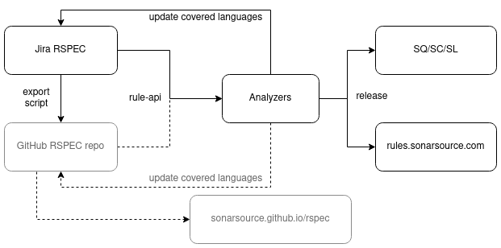

ifdef::env-github[]
:warning-caption: :warning:
:note-caption: :information_source:
endif::[]
= SonarSource Rule Specification repository

This repository contains the specification of every static-analysis rule available in SonarLint, SonarCloud, or SonarQube.

It also contains rules which have been dropped and rules which will one day be implemented.

WARNING: **Beta status**: This repository is not used yet in production. The current source of truth remains the https://jira.sonarsource.com/issues/?jql=project%20%3D%20RSPEC[Rule Respository project in Jira]. **Do not create rules in this repository for now**. See <<beta,the "During the Beta" section>> for more information.

== Rules directory structure

* https://github.com/SonarSource/rspec/tree/master/rules[rules] directory: contains every specified rule.
** `rules/Sxxxx`: contains every specification for rule `Sxxxx`.
*** `rules/Sxxxx/*.adoc`: Asciidoc files which can be reused by multiple language-specific descriptions.
*** `rules/Sxxxx/metadata.json`: rule metadata shared between language-specific RSPECs. Each language can override fields in its own `metadata.json` file.
*** `rules/Sxxxx/[LANGUAGE]`: contains the language-specific RSPEC. For every rule, there must be at least one `[LANGUAGE]` subdirectory. +
`[LANGUAGE]` can be any of the following: 
include::supported_languages.adoc[]
**** `rules/Sxxxx/[LANGUAGE]/rule.adoc`: asciidoc file used to generate the `Sxxxx` rule description for programming language `[LANGUAGE]`. It can include parts from `*.adoc` files located in the parent directory.
**** `rules/Sxxxx/[LANGUAGE]/metadata.json`: metadatas for the specific language. Each key at the top will completely override the key of the `metadata.json` file of the parent directory.

== Search rules

Go to the https://sonarsource.github.io/rspec/#/[Search Page] to find the rules that have already been merged in the `master` branch.

Go the the GitHub https://github.com/SonarSource/rspec/pulls[pull-request] tab to find the rules that have not been merged yet.
You can use the "Search in unimplemented" link on the Search Page to repeat your search in the PRs.

WARNING: Unlike the Search Page, the GitHub search across the PRs for unimplemented rules considers only the PR summary and title. It does not search the content of the proposed rule (i.e. it does not look into `rule.adoc` nor into `metadata.json`).

== Create or modify a rule

Jira currently contains both implemented and unimplemented rules. This is why the `rules` directory contains both too.

However, one of the reasons we are migrating to a git repository is that we want to have a clean process and history for rule creation and modification. Thus every newly created rule should follow this workflow:

=== 1. Create a pull request

==== For a new rule
1. go to the https://github.com/SonarSource/rspec/actions/workflows/create_new_rspec.yml[Create new RSPEC] GitHub action
2. click on the grey _Run wokflow_ button (on the right).
3. in the field _"Comma-separated list of targeted languages"_ write the list of languages you want to specify this rule for. +
They can be any of the following: 
include::supported_languages.adoc[]
4. click on the green _Run workflow_ button.

image::img/new-rule-workflow.png[]

==== To modify an existing rule
Create a branch for your modifications manually.
Then open a pull request manually.
The subject must start with the following required prefix:
----
Modify rule Sxxxx
----
Add a short summary of the PR after the required prefix. For example:
----
Modify rule S1234: Allow tail recursion for languages supporting TCO
----

NOTE: use a GitHub hot-key `t` in the source view to navigate to an existing rule specification.

=== 2. Edit the pull request

You should see https://github.com/pulls/assigned[a new pull request assigned to you]. It might take up to a few minutes to appear.
It contains a scaffolding of files for the new rule. Feel free to modify it as you please.

The title of the PR for a new rule will say only "Create rule Sxxxx", which is not very informative.

Modify the title to better summarize the nature or the rule, so that it is easier to find when searching through unimplemented rules.
Do preserve the "Create rule Sxxxx" prefix, as it is used by our tooling.
For example:

----
Create rule S7028: All identifiers should be in CamelCase
----

Add the description of the PR to further increase its discoverability
(GitHub PR search does not see the `rule.adoc`).
To do that, click on the three dots (next to the smile) on the first comment (created by github-actions bot) and select "Edit".

The rule must contain subdirectories corresponding to all the languages this rule is implemented for.

Each language subdirectory contains the `rule.adoc` that is the root document used to render the specification.
The rule specification in `rule.adoc` can include other `*.adoc` files that are in the language subdirectory or in the parent directory by using the `include::content.adoc[]` syntax.

To reduce the number of turnarounds with the asciidoc edits you can install an asciidoc plugin.
Otherwise, you can use https://asciidoclive.com/[AsciiDocLIVE] and this https://docs.asciidoctor.org/asciidoc/latest/syntax-quick-reference/[cheatsheet].

=== 3. Ask for a review

Every new rule should be reviewed.

If it is a new rule, or if it requires the analyzer to change its implementation, do not merge the pull request yet.

If the change does not require an implementation, merge the pull request after the review.

=== 4. Create an implementation ticket

In your analyzer create an implementation ticket and reference the pull request as follow:
----
RSPEC PR: SonarSource/rspec#xxxx
----

In the pull request adding the rule specification add the following text referencing the implementation ticket.
----
Implementation ticket: SonarSource/sonar-java#xxx
----
Replace the repository with the one you currently work on.

=== 5. Implement the rule

Implement the rule, update analyzer's metadata, and merge the rule implementation in your analyzer repository.
Afterwards, merge the RSPEC pull request.

==== Generate/Update rule metadata for the analyzer

* Download the last version of https://github.com/SonarSource/sonar-rule-api[rule-api].
* call `gh_generate` if you are adding a rule, or `gh_update` if you just want the last specification version.

Example:
[source,shell]
----
$ java -jar rule-api-1.24.3.jar gh_generate -rule S4328
# or
$ java -jar rule-api-1.24.3.jar gh_update
----

NOTE: If you generate rules in an empty directory,
you have to run `gh_update` immediately after,
because rule-api relies on the files in the directory to determine the covered set of rules
when generating the deprecation notes for superseded rules.

== During the Beta
[#beta]
A https://en.wikipedia.org/wiki/Cron[cron job] currenlty imports rules from https://jira.sonarsource.com/issues/?jql=project%20%3D%20RSPEC[Jira] to this repository every night. You can edit rules in this repository just to test it, but real specification work should be done in Jira.

WARNING: On top of the Jira Markdown pitfalls, the conversion script tends to break on specific syntax. Please see https://docs.google.com/document/d/1kseOIF8fVKTwg0v5-pw7GZYUg15uY8XHM3augh5OoUA/edit[Jira markdown quirks] for the list of known issues to avoid in your RSPECs.

== Tooling
https://github.com/SonarSource/rspec/tree/master/rspec-tools[rspec-tools]::
A python CLI tool for adding and validating rules. It is used by GitHub checks and GitHub actions.
For more information see the README file in the `rspec-tools` directory.
https://github.com/SonarSource/rspec/tree/master/frontend[frontend]::
The GitHub page that enables the search for rules.
For more information see the README file in the `frontend` directory.

== RSPEC dataflow
Current path of an RSPEC from its inception in Jira RSPEC project to its consumption in SQ/SC/SL or on rules.sonarsource.com:

Here the github flow is grayed out, because it is rudimentary and exists solely for the beta-testing purpose.
However, once the beta-testing period is over, the flow will look differently:

image::img/RSPEC-flow-2.png[]

Here Jira RSPEC project becomes read-only, and the github repository becomes the source of truth.
Once Jira RSPEC is frozen, the export script becomes unncessary and will be stopped.
The https://sonarsource.github.io/rspec/#/[search page] taps directly into the GitHub repository and indexes the rules to
replace the powerful search from the now-obsolete Jira database.
