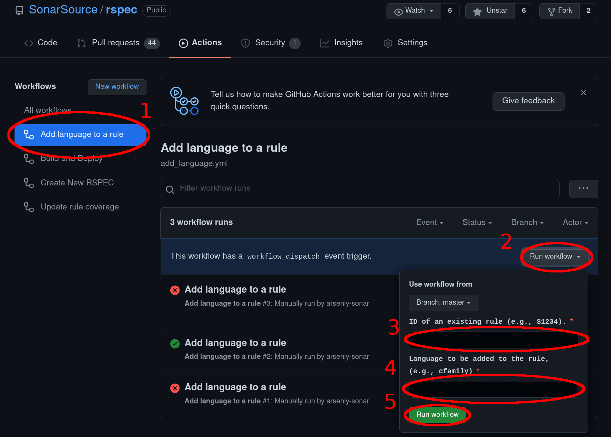

ifdef::env-github[]
:warning-caption: :warning:
:note-caption: :information_source:
endif::[]
= SonarSource Rule Specification repository

This repository contains the specification of every static-analysis rule available in SonarLint, SonarCloud, or SonarQube.

It also contains rules which have been dropped and rules which will one day be implemented.

== Rules directory structure

* https://github.com/SonarSource/rspec/tree/master/rules[rules] directory: contains every specified rule.
** `rules/Sxxxx`: contains every specification for rule `Sxxxx`.
*** `rules/Sxxxx/*.adoc`: Asciidoc files which can be reused by multiple language-specific descriptions.
*** `rules/Sxxxx/metadata.json`: rule metadata shared between language-specific RSPECs. Each language can override fields in its own `metadata.json` file. +
It is thanks to this file that you can add `tags`, `securityStandards` etc... to your rule.
*** `rules/Sxxxx/common`: contains common content shared by all the supported languages. It is organized in the following subdirectories:
**** `rules/Sxxxx/common/fix`
**** `rules/Sxxxx/common/images`
**** `rules/Sxxxx/common/pitfalls`
**** `rules/Sxxxx/common/resources`
*** `rules/Sxxxx/[LANGUAGE]`: contains the language-specific RSPEC. For every rule, there must be at least one `[LANGUAGE]` subdirectory. +
`[LANGUAGE]` can be any of the following:
include::supported_languages.adoc[]
**** `rules/Sxxxx/[LANGUAGE]/rule.adoc`: asciidoc file used to generate the `Sxxxx` rule description for programming language `[LANGUAGE]`. It can include parts from `*.adoc` files located in the parent directory.
**** `rules/Sxxxx/[LANGUAGE]/metadata.json`: metadatas for the specific language. Each key at the top will completely override the key of the `metadata.json` file of the parent directory.

== Rule description file

Refer to the <<docs/description.adoc#,documentation about rules description>> for the content of the rule.adoc file.

== Metadata file

Refer to the <<docs/metadata.adoc#,documentation about the metadata file>> for the content of the metadata.json file.

== Non-content modifications

Refer to the <<docs/testing.adoc#,documentation about testing>> if you plan to change something else than rules.

== Search rules

All specified rules (implemented or not) are listed in the https://sonarsource.github.io/rspec/#/[Search Page].

For each rule, you can find the languages it covers, the descriptions for each language as well as the related open tickets and pull requests. +
There will be a red warning with a link to the rule pull request if the rule has not been implemented yet (i.e. is not present on the main branch yet).

You can also use GitHub search among unmerged PRs https://github.com/SonarSource/rspec/pulls[here].

WARNING: Unlike the Search Page, the GitHub search across the PRs for unimplemented rules considers only the PR summary and title. It does not search the content of the proposed rule (i.e. it does not look into `rule.adoc` nor into `metadata.json`).

[[AddModifyRule]]
== Create or modify a rule

Before, the Languages Team used Jira to host both implemented and unimplemented rules. This is why the `rules` directory contains both too.

However, one of the reasons we are migrating to a git repository is that we want to have a clean process and history for rule creation and modification.

In particular, the main branch aims at representing what will be integrated in the next version of the analyzers, i.e. what will be part of the next releases.

Thus every newly created rule or modification of rule should follow these steps:

. Create a pull request adding or modifying a rule
. Ask for a review
. Create an implementation ticket
. Implement the new rule or the change in the existing rule
. Fetch the updated metadata with `rule-api` by pointing it to the PR branch with `-branch` parameter
. Merge the implementation PR
. Merge the RSPEC PR

A <<multi-language-rule-creation>> is somewhat more involved.

=== 1. Create a pull request

==== To create a new rule
. go to the https://github.com/SonarSource/rspec/actions/workflows/create_new_rspec.yml[Create new RSPEC] GitHub action
. click on the grey _Run wokflow_ button (on the right).
. in the field _"Comma-separated list of targeted languages"_ write the list of languages you want to specify this rule for. +
They can be any of the following:
include::supported_languages.adoc[]
. click on the green _Run workflow_ button.

You should see https://github.com/pulls/assigned[a new pull request assigned to you] with the appropriate language labels.
It might take up to a few minutes to appear.
It contains a scaffolding of files for the new rule. Feel free to modify it as you please.

The title of the PR for a new rule will say only "Create rule Sxxxx", which is not very informative. +
Modify the title to better summarize the nature or the rule, so that it is easier to find when searching through unimplemented rules.
Do preserve the "Create rule Sxxxx" prefix, as it is used by our tooling.
For example:

----
Create rule S7028: All identifiers should be in CamelCase
----

Add the description of the PR to further increase its discoverability
(GitHub PR search does not see the `rule.adoc`).
To do that, click on the three dots (next to the smile) on the first comment (created by github-actions bot) and select "Edit".

The rule must contain subdirectories corresponding to all the languages this rule will be implemented for.

Each language subdirectory contains the `rule.adoc` that is the root document used to render the specification.
The rule specification in `rule.adoc` can include other `*.adoc` files that are in the language subdirectory or in the parent directory by using the `include::content.adoc[]` syntax.

To reduce the number of turnarounds with the asciidoc edits you can install an asciidoc plugin.
Otherwise, you can use https://asciidoclive.com/[AsciiDocLIVE] and this https://docs.asciidoctor.org/asciidoc/latest/syntax-quick-reference/[cheatsheet].

==== To add language to an existing rule

Similar to adding a new rule, if the rule exists on the main branch, trigger the "Add language to a rule" GitHub action.

. go to the https://github.com/SonarSource/rspec/actions/workflows/add_language.yml[Add language to a rule] GitHub action
. click on the grey _Run workflow_ button (on the right).
. in the field _"ID of an existing rule"_ write the ID of the existing rule you want to add language to.
It must be in a form `Sxxxx` where `xxxx` is the number of the rule.
For example: `S100`, `S1234`, or `S6000`.
. in the field _"Language to be added to the rule"_ specify one language you want to add to the rule. +
It can be any of the following:
include::supported_languages.adoc[]
. click on the green _Run workflow_ button.

You should see https://github.com/pulls/assigned[a new pull request assigned to you] with the appropriate language label.
It might take up to a few minutes to appear.
It contains a scaffolding of files for the new rule. Feel free to modify it as you please.

The title of the PR for a new rule will say only "Create rule Sxxxx", which is not very informative. +
Modify the title to better summarize the nature or the rule, so that it is easier to find when searching through unimplemented rules.
Do preserve the "Create rule Sxxxx" prefix, as it is used by our tooling.
For example:
----
Create rule S100: Method names should comply with a naming convention
----

Otherwise, if the rule has not been merged yet (i.e. the rule has not been implemented by any plugin), you can use the already existing PR corresponding to this rule. +

==== To modify an existing rule
Create a branch for your modifications manually.
Then open a pull request manually.
The subject must start with the following required prefix:
----
Modify rule Sxxxx
----
Add a short summary of the PR after the required prefix. For example:
----
Modify rule S1234: Allow tail recursion for languages supporting TCO
----
Add at least one label corresponding to the language(s) the PR relates to.

==== To deprecate a rule
Create a branch for the deprecation manually.
Then open a pull request manually.
In the subject add the following text:
----
Deprecate rule Sxxxx
----
Add at least one label corresponding to the language(s) the PR relates to.

In the `metadata.json` of the rule you want to deprecate:

* Remove all tags
* Remove all quality profiles
* Change the status to `deprecated`
* Fill in the `replacementRules` array with strings in the form `"RSPEC-xxxx"` with the rules that deprecate this one, if any

See link:rules/S1212/metadata.json[S1212] for an example.

==== To delete a rule
If the rule has never been implemented and is still defined in an open pull request, just close the pull request. +
Otherwise, create a pull request to change the status of the rule to "closed".

NOTE: use a GitHub hot-key `t` in the source view to navigate to an existing rule specification.

=== 2. Ask for a review

Every PR that is creating or modifying a rule should be reviewed.
Exceptions can be made for small PRs that only resolve simple spelling mistakes.

If it is a new rule, or if it requires the analyzer to change its implementation, do not merge the pull request yet.

If the change does not require an implementation, merge the pull request after the review.

Following the submission of every PR, an automatic checklist will be generated.
This checklist is intended for the reviewer and serves as a guide to ensure comprehensive evaluation of the PR.
As the reviewer navigates through the review process, each fulfilled item on the checklist should be marked off.

A PR should not be merged before the checklist is fully completed.
This ensures that all necessary checks have been made, and all requirements have been met before merging, fostering a systematic and thorough review process.

=== 3. Create an implementation ticket

Create an implementation ticket as it is usually done for your plugin (i.e. as a Jira ticket or a Github issue). +
For this ticket to be correcty indexed on the search page of the rules, it has to contain the rule ID (RSPEC-1234 or S1234) either in the ticket title or in the ticket description. +
It is also recommended to add a link to the Github Page of the related rule, to ease the navigation between the ticket and the rule.

In the pull request adding the rule specification, add the following text referencing the implementation ticket:
----
Implementation ticket: CPP-1234 (for a CFamily ticket on Jira)
----
or
----
Implementation ticket: SonarSource/sonar-dotnet/issues/1234 (for a sonar-dotnet issue on Github)
----

=== 4. Implement the rule

Implement the rule or the modification as usual, generate the rule metadata,
and merge the rule implementation in your analyzer repository.

==== Generate rule metadata for the analyzer

* Download the last version of https://github.com/SonarSource/sonar-rule-api[rule-api].
* Run `generate` and specify the RSPEC-repository branch with the modified version of the rule specification.

Example:
[source,shell]
----
$ java -jar rule-api-2.1.0.jar generate -branch <RSPEC branch> -rule S4328
----

=== 5. Merge the RSPEC PR

Once the corresponding implementation is done you can merge the PR containing the new rule
(or the new version of the existing rule).

=== Multi-Language Rule Creation
Multi-language rule creation has more steps than the default process because it involves multiple roles that typically do not coincide.
It is infeasible to synchronize the implementation of the rule for all the languages it covers.

. An RSPECator creates a PR and specifies the multi-language rule.
 * The RSPECator asks for a review for the PR.
 * The RSPECator does not merge the PR, even after the review is done.
. The RSPECator opens implementation tickets for all the targeted languages.
. An Ada analyzer developer Alice implements the rule first. Alice prepares the PR with the implementation.
. As soon as the implementation of the rule is ready for Ada analyzer, Alice merges both PRs:
.. Alice fetches the rule metadata with `rule-api` into Ada analyzer. She needs to specify the PR branch in the `-branch` argument of `rule-api`.
.. Alice merges the rule implementation in Ada analyzer.
.. Alice merges the RSPEC PR opened by the RSPECator.
. A Cobol analyzer developer Bob implements the rule some time later. Bob prepares the PR with the implementation.
. As soon as the Cobol implementation is ready:
.. If Bob needs to change the rule specification, he opens an RSPEC PR and uses the PR branch in the `-branch` argument of `rule-api`.
.. Bob fetches the rule metadata with `rule-api` into Cobol analyzer.
.. Bob merges the rule implementation in Cobol analyzer.
.. If Bob had opened an RSPEC PR with changes, he merges it once the rule is implemented in the analyzer.

== Untriaged Pull Requests

Untriaged PRs are the ones without any GitHub label assigned to them.
You can easily see all of them with the filter https://github.com/SonarSource/rspec/pulls?q=is%3Aopen+is%3Apr+no%3Alabel[`no:label`].

All triaged PRs should have at least one label that corresponds to the bubble(s) the PR is related to.
This allows bubbles to easily filter the PRs they are interested in.

== Tooling
https://github.com/SonarSource/rspec/tree/master/rspec-tools[rspec-tools]::
A python CLI tool for adding and validating rules. It is used by GitHub checks and GitHub actions.
For more information see the README file in the `rspec-tools` directory.
https://github.com/SonarSource/rspec/tree/master/frontend[frontend]::
The GitHub page that enables the search for rules.
For more information see the README file in the `frontend` directory.

== RSPEC dataflow

The following graph shows the path of an RSPEC from its inception in Github RSPEC repository to its consumption in SQ/SC/SL or on rules.sonarsource.com: +
(The part that is grayed out corresponds to what existed before, when RSPECs were hosted in Jira)

image::img/RSPEC-flow-2.png[]

== Help

Tickets related to this RSPEC repository are in Jira, in the https://jira.sonarsource.com/projects/RULEAPI/issues/RULEAPI-324?filter=allopenissues[RULEAPI] project.

You found a bug, something is bothering you or you have an idea of how to improve the project? First, have a look at all the https://jira.sonarsource.com/projects/RULEAPI/issues/RULEAPI-324?filter=allopenissues[open tickets]. If you don't see anything related to your subject, please open a new ticket in the backlog, with `backlog` as the fix version.
